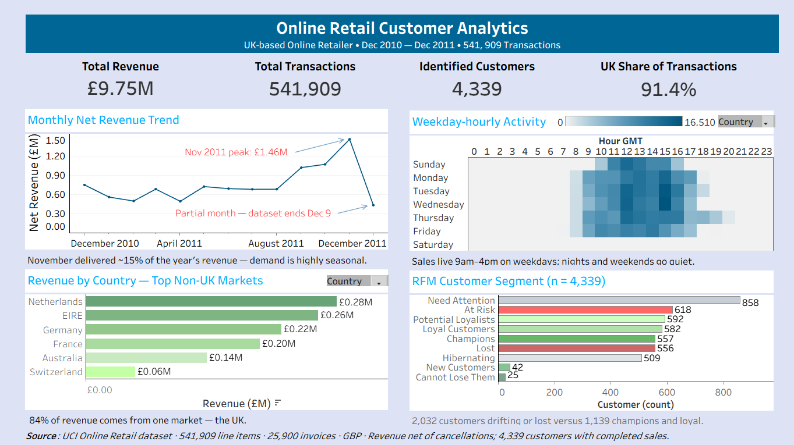

# Online Retail Customer Analytics

A UK-based online gift retailer, December 2010 – December 2011: where the revenue comes from, who the customers are, and what to do next — analyzed with **SQL**, **Python**, and **Tableau**, with an **AI-assisted workflow** (draft → human verification) documented end to end.



> **Interactive version:** [Online Retail Customer Analytics on Tableau Public](https://public.tableau.com/app/profile/christian.osadebe/viz/Tableau_17912908627000/OnlineRetailCustomerAnalytics) *(GitHub can't render Tableau workbooks in-browser; the `.twbx` below is the full source.)*

## Key findings

- **£9.75M net revenue** across 541,909 invoice line items and 25,900 invoices — a domestic wholesaler with a thin export layer: the **UK is 91.4% of transactions** and **84% of revenue**.
- **Seasonal, weekday, midday rhythm:** November delivers ~15% of annual revenue; February is the trough; Thursday and 12:00 GMT are the peaks. 20:00 GMT is the natural maintenance window.
- **Value concentrated:** one customer spent £279,489; the top 10 account for 17.3% of completed-sales revenue; delivery fees (DOTCOM POSTAGE, £206,245) are a revenue line in their own right.
- **Healthy but leaky:** 1.71% cancellation rate — yet **24.9% of line items have no CustomerID** (133,600 of them UK), leaving a quarter of domestic sales invisible to retention marketing.
- **RFM retention map (4,339 customers):** 557 Champions to protect, 618 At Risk to win back, and 25 "Cannot Lose Them" customers (avg £2,123 spend, ~231 days since order) — the highest-value win-back pool in the base.

The full stakeholder narrative is in [`Online_Retail_Stakeholder_Report.pdf`](Online_Retail_Stakeholder_Report.pdf).

## Project structure

```
├── data/                     # Online_Retail.csv (UCI Machine Learning Repository) + data dictionary
├── sql/                      # schema.sql — table definition; analysis.sql — full analysis queries
├── python/                   # analysis.py — pandas analysis; charts/ — generated figures
├── tableau/
│   ├── Tableau.twbx          # Packaged workbook (data bundled) — the dashboard source
│   ├── Tableau.twb           # Workbook XML
│   ├── Online_Retail_Dashboard.png   # Static dashboard export
│   └── data/                 # CSV extracts feeding the workbook
├── ai-workflow/              # AI-assisted analytics, fully documented
│   ├── PROMPT_LOG.md             # Every prompt, verbatim, with verification results
│   ├── ai-eda-hypotheses.md      # 8 hypotheses → tested → confirmed/refuted/nuanced
│   ├── ai-insight-narrative.md   # AI-drafted, human-verified insight narrative
│   ├── ai-excel-kpi-formulas.md  # KPI formulas + narration template, logic-checked
│   └── SKILLS_DEMONSTRATED.md    # Index of the AI techniques used
└── Online_Retail_Stakeholder_Report.pdf  # Stakeholder report
```

## Reproduce the analysis

**Python**
```bash
pip install -r python/requirements.txt
python python/analysis.py
```

**SQL** — create the table, load the CSV, then run the analysis:
```bash
psql -f sql/schema.sql
psql -f sql/analysis.sql
```

**Tableau** — open `tableau/Tableau.twbx` in Tableau Desktop (data is bundled).

## Figure provenance

One canonical engine per artifact; exceptions are tagged inline.

- **Python** is canonical for the dashboard, narrative, and this README. Revenue is **net** (cancellations included as negatives); customer counts (4,339), RFM, cohort, and top-10 figures use **completed sales only** (33 customer IDs appear solely in cancelled invoices).
- **SQL** (`sql/`) is the canonical source for the query layer; its RFM counts differ slightly from Python's (Champions 569, At Risk 627, Cannot Lose Them 28) due to quintile-boundary differences.

## Data source

[UCI Machine Learning Repository — *Online Retail*](https://archive.ics.uci.edu/dataset/352/online+retail) (Chen, D.): transactions from a UK-based online gift retailer, December 2010 – December 2011 (541,909 rows; CC BY 4.0). The working CSV used here was provided via the course (a conversion of UCI's xlsx). See `data/README.md` for the column dictionary.
